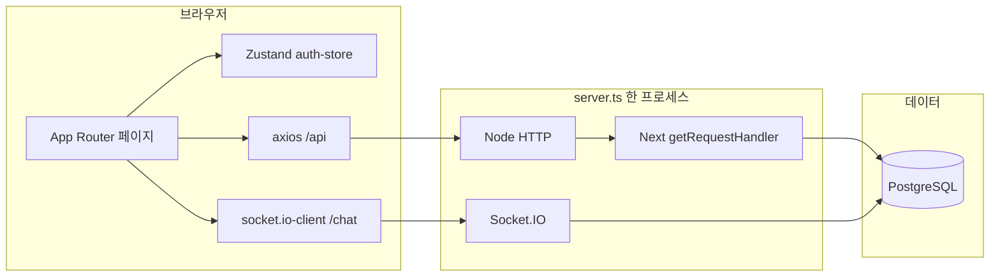
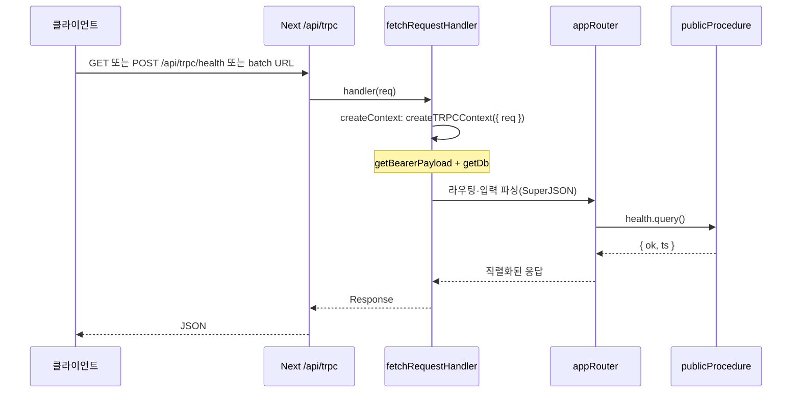

# next-book-app

Next.js 단일 앱으로 **인증·게시글·북(슬라이드) 에디터·AI 보조·채팅·데모 API**까지 묶은 풀스택 프로젝트입니다. UI는 Tailwind 4 및 shadcn 스타일 컴포넌트를 사용합니다.

---

## 기술 스택

| 구분 | 사용 기술 |
|------|-----------|
| 프레임워크 | **Next.js 16** (App Router), **React 19** |
| 커스텀 서버 | **`server.ts`**: HTTP 하나에 Next `getRequestHandler` + **Socket.IO** (`/socket.io`, 네임스페이스 `/chat`) |
| API | **Route Handlers** (`src/app/api/**/route.ts`) — REST 스타일 `/api/...` |
| DB | **PostgreSQL**, **Drizzle ORM**, 드라이버 `postgres` |
| 인증 | **JWT**(액세스·리프레시), **jose**, 액세스는 `sessionStorage`, 리프레시는 **httpOnly 쿠키** + 로테이션 |
| 실시간 | **socket.io** / **socket.io-client** — 로비·방 채팅, 메시지·방 메타 **DB 영속화** |
| 타입 안전 API(보조) | **tRPC** — 예: `health` 등 최소 프로시저 (`/api/trpc`) |
| HTTP 클라이언트 | **axios** (`baseURL` 기본 `/api`, `withCredentials`) |
| 상태·데이터 | **Zustand**(인증), **TanStack Query** |
| 검증 | **Zod** |
| 스타일 | **Tailwind CSS 4**, **Radix / Base UI**, **CVA**, **next-themes** |
| 에디터·미디어 | **TipTap**, **Konva**, **react-konva**, **Three.js** + **R3F**·**drei** 등(홈 3D·북 관련) |

---

## 주요 프로그램 흐름



1. **요청 진입**: 브라우저는 페이지·RSC는 Next로, REST는 대부분 **`/api/*`**로 요청합니다.
2. **정적 업로드**: 파일은 디스크(`UPLOAD_ROOT`)에 두고 **`/uploads/[...path]`** 라우트로 서빙합니다.
3. **채팅**: 로그인 후 **`ChatDock`**이 **동일 오리진**의 `/chat` 네임스페이스에 연결합니다. JWT는 `auth: { token }`으로 핸드셰이크 시 검증합니다.
4. **부트스트랩**: 서버 기동 시(및 일부 인증 진입 시) `ensureUserBootstraps()`로 초기 관리자 등 시드 로직이 실행될 수 있습니다 (`src/instrumentation.ts`, `bootstrap` 서비스).

---

## 인증 흐름

### 토큰 역할

- **액세스 JWT**: 짧은 만료. 클라이언트는 **`sessionStorage`** 키 `access_token`에 보관하고, API 요청 시 **Authorization: Bearer** 로 전송합니다.
- **리프레시 JWT**: 긴 만료. **httpOnly·Secure(프로덕션) 등 쿠키**로만 전달되며, 클라이언트 JS에서 읽지 않습니다. 갱신 시 새 리프레시로 **로테이션**됩니다.

### 클라이언트 세션 복구 (`auth-store` → `hydrate`)

1. `sessionStorage`에 액세스 토큰이 있으면 **`GET /api/users/me`** 로 프로필 조회.
2. 실패(만료 등) 시 **`POST /api/auth/refresh`** (쿠키만)로 새 액세스 토큰 발급 후 다시 `/users/me`.
3. 액세스 토큰이 없어도 리프레시 쿠키가 있으면 refresh 후 동일하게 복구.
4. 끝까지 실패하면 액세스 토큰을 제거하고 비로그인 처리, **`isReady: true`** 로 UI가 스피너 대신 본 화면을 그립니다.

### 주요 API 엔드포인트

| 메서드 | 경로 | 설명 |
|--------|------|------|
| POST | `/api/auth/signup` | 회원가입 |
| POST | `/api/auth/signin` | 로그인 — JSON에 `access_token`, `Set-Cookie`에 리프레시 |
| POST | `/api/auth/refresh` | 리프레시 쿠키로 액세스 재발급(및 쿠키 갱신) |
| POST | `/api/auth/logout` | 로그아웃·쿠키 정리 |
| GET/PATCH | `/api/users/me` | 내 프로필 조회·수정 |
| GET | `/api/users/admin` | 관리자용 사용자 목록 등 |
| POST | `/api/users/admin/set-role` | 역할 변경 |

JWT 서명·검증·만료 설정은 `src/server/auth/jwt.ts`, 상수는 `src/server/env.ts`를 참고하면 됩니다.

---

## 도메인 기능과 API 개요

- **게시글(글)**: `/api/posts` — 목록·작성·수정·삭제, **`category` 쿼리·본문 필드**로 필터·저장(`tech`, `life`, `study`, `chat`, `general` — 라벨은 `src/lib/post-categories.ts`). 댓글·대댓글·좋아요, 멀티파트 첨부(이미지·동영상).
- **북(슬라이드)**: `/api/books`, 페이지 JSON, 업로드, **`/api/books/ai/chat`**, **`/api/books/ai/layout`**.
- **채팅(소켓)**: 네임스페이스 `/chat` — 방 목록·입장·메시지·방 삭제 등. 스키마: `chat_room`, `chat_message` (`src/server/db/schema.ts`).
- **Cats (학습/데모)**: REST `/api/cats` — 아래 절 참고.
- **날씨·뉴스(데모)**: `/api/weather/current`, `/api/weather/seoul`, `/api/news/headlines` — 외부 API 키·쿼리는 각 Route Handler·서비스 참고.

페이지는 `src/app/(site)/**/page.tsx`가 라우트이고, 실제 화면 본문은 `@/page-components/*`에서 import하는 구조입니다(Next가 `src/pages`를 Pages Router로 오인하지 않도록 분리).

---

### 게시글 카테고리(글 `category`)

- **허용 값**: `tech` · `life` · `study` · `chat` · `general` (한글 라벨: 기술·일상·학습·잡담·일반).
- **목록 API**: `GET /api/posts?category=...` 로 필터. UI는 `PostListPage`에서 URL `?category=` 와 동기화.
- **정규화**: 서버는 `normalizePostCategory` (`src/server/posts/post-categories.ts`)로 저장·검증합니다.

### Cats (학습용 CRUD + 이미지)

NestJS 스타일 학습 흔적(가드 샘플·메타 필드)이 일부 붙어 있는 **별도 데모 도메인**입니다. 게시글 `category`와 무관합니다.

| 메서드 | 경로 | 설명 |
|--------|------|------|
| GET | `/api/cats` | 전체 목록. 응답에 `_study.decoratorCatsClientMeta`(IP·UA 스냅샷) 포함 |
| POST | `/api/cats` | 등록 — **Bearer 필수**, 본문: 이름·나이·품종 등 (`parseCreateCatBody`) |
| GET | `/api/cats/[id]` | 단건 |
| PATCH | `/api/cats/[id]` | 수정 — 소유자 또는 관리자 (`canMutateCatResource`) |
| DELETE | `/api/cats/[id]` | 삭제 — 동일 권한 |
| POST | `/api/cats/[id]/image` | 사진 업로드(용량·MIME 제한), `/uploads/...` 경로로 노출 |

- **DB**: 테이블 `study_cats` — `name`, `age`, `breed`, `ownerId`, `imageFilename`, 타임스탬프 (`src/server/db/schema.ts`).
- **UI**: `/cats`, `/cats/[id]` — `CatsPage`, `CatDetailPage`; TanStack Query + REST (`src/lib`의 cats API 헬퍼).
- **참고**: `/api/cats/_study/guard-sample` — 가드 순서 학습용 샘플 엔드포인트.

### 날씨·뉴스 API(요약)

| 메서드 | 경로 | 설명 |
|--------|------|------|
| GET | `/api/weather/current` | 쿼리 `q` 등으로 현재 날씨 (`WeatherService`) |
| GET | `/api/weather/seoul` | 서울 고정 예시 |
| GET | `/api/news/headlines` | `country`, `category`, `pageSize` — NewsAPI 카테고리 화이트리스트는 서비스 내 `CATEGORIES` |

---

## tRPC 설정과 요청 흐름

이 프로젝트는 **비즈니스 대부분을 REST Route Handler**로 두고, tRPC는 **보조 타입 안전 API** 슬롯으로 `/api/trpc`에 연결되어 있습니다. 패키지는 `@trpc/server`·`@trpc/client`·`@trpc/react-query`(v11)가 있으나, **현재 앱 코드에서는 서버 라우트와 `health` 프로시저만 사용**하고 React tRPC 클라이언트는 아직 연결하지 않았습니다.

### 관련 파일

| 역할 | 경로 |
|------|------|
| Next Route Handler (HTTP 진입) | `src/app/api/trpc/[trpc]/route.ts` |
| `fetch` 어댑터 + 라우터 연결 | 위 파일에서 `fetchRequestHandler` |
| 컨텍스트(DB·JWT) | `src/server/trpc/context.ts` — `createTRPCContext({ req })` |
| `initTRPC`·SuperJSON | `src/server/trpc/trpc.ts` |
| 루트 라우터·프로시저 정의 | `src/server/trpc/routers/_app.ts` |

### 요청 흐름



### 컨텍스트·프로시저

- **컨텍스트**: `Request`에서 Bearer JWT를 읽어 `user`를 채우고, Drizzle `db`를 넣습니다. REST의 `requireBearerPayload`와 동일한 `getBearerPayload` 계열을 사용합니다.
- **라우터**: `appRouter`에 `health` **query** 하나만 정의되어 `{ ok: true, ts: number }`를 반환합니다.
- **확장**: `src/server/trpc/routers/_app.ts`에 프로시저를 추가하고, 인증이 필요하면 `trpc.ts`에 `protectedProcedure`(미들웨어로 `ctx.user` 검증)를 두는 패턴으로 확장하면 됩니다. 클라이언트에서는 `createTRPCReact<AppRouter>()` + `httpBatchLink`로 `baseUrl + '/api/trpc'`를 지정해 연결할 수 있습니다.

---

## 디렉터리 가이드(요약)

```
src/
  app/                 # App Router — page.tsx, layout, api/, uploads/
  page-components/     # 큰 화면 단위 UI (라우트에서 import)
  components/          # 공용·기능 컴포넌트 (ChatDock, 레이아웃 등)
  server/
    auth/              # JWT, 페이로드 타입
    db/                # Drizzle 스키마·클라이언트
    services/          # 도메인 서비스 (auth, posts, books, …)
    chat/              # Socket.IO `/chat` 네임스페이스 부착 로직
    trpc/              # tRPC context, init, `routers/_app` (엔드포인트 `/api/trpc`)
    cats/              # Cats API 요청 본문 파싱
    http/              # 쿠키·공통 응답 유틸
  lib/                 # axios 래퍼, 스키마, 쿼리 클라이언트 등
  stores/              # Zustand (auth-store)
server.ts              # Next + Socket.IO 진입점
```

---

## 환경 변수

로컬은 루트 **`.env`** 를 사용합니다. 주요 항목:

- **DB**: `DB_HOST`, `DB_PORT`, `DB_USERNAME`, `DB_PASSWORD`, `DB_NAME`
- **JWT**: `JWT_ACCESS_SECRET`, `JWT_REFRESH_SECRET`, (선택) `JWT_ACCESS_EXPIRES_IN`, `JWT_REFRESH_EXPIRES_IN`
- **업로드**: `UPLOAD_ROOT`
- **부트스트랩 관리자**: `BOOTSTRAP_ADMIN_EMAILS` (쉼표 구분 이메일)
- **CORS**: `FRONTEND_ORIGIN` (비우면 관대한 기본)
- **프론트 API 베이스**: `NEXT_PUBLIC_API_BASE_URL` — 비우면 **`/api`**(단일 오리진). 별도 API 호스트를 둘 때만 절대 URL 지정

채팅·북 AI·날씨·뉴스 등 외부 API 키는 해당 서비스 코드·기존 `.env` 주석을 참고하면 됩니다.

---

## 스크립트

| 명령 | 설명 |
|------|------|
| `npm run dev` | `tsx server.ts` — 개발 모드(Next + Socket.IO) |
| `npm run build` | 프로덕션 빌드 |
| `npm run start` | 프로덕션 실행(`NODE_ENV=production tsx server.ts`). Windows CMD에서는 환경 변수 설정 방식이 다를 수 있음 |
| `npm run db:push` | Drizzle 스키마를 DB에 반영(`drizzle-kit push`) |
| `npm run db:studio` | Drizzle Studio |
| `npm run db:generate` | 마이그레이션 SQL 생성 |

---

## Docker

- **개발**: `docker compose -f docker-compose.dev.yml up` — PostgreSQL + 볼륨 마운트로 `npm run dev`(스키마 `db:push` 포함).
- **배포 예시**: `docker compose up`(루트 `docker-compose.yml`) — 이미지 빌드 후 `npx tsx server.ts`로 기동.

> **배포 참고**: 앱은 **커스텀 `server.ts`** 로 동작하므로, Vercel 같은 순수 서버리스만으로는 Socket.IO까지 동일 구조 유지가 어렵습니다. **Docker·VM·K8s 등 장기 프로세스** 호스팅을 권장합니다.

---

## 확장 시 알아둘 점

- **Socket.IO 수평 확장**: 현재는 단일 프로세스 기준입니다. 인스턴스를 여러 대 띄우려면 **Redis 어댑터** 등으로 방 브로드캐스트를 공유하는 설계가 필요합니다.
- **tRPC**: 구조·흐름·확장 방법은 위 **[tRPC 설정과 요청 흐름](#trpc-설정과-요청-흐름)** 절을 참고하세요.

---

## 라이선스

Private 프로젝트(`package.json`의 `"private": true`).
