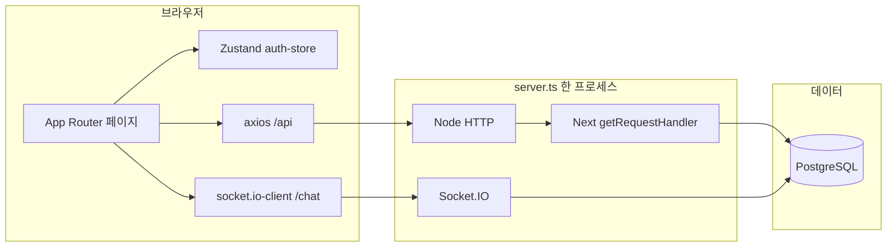
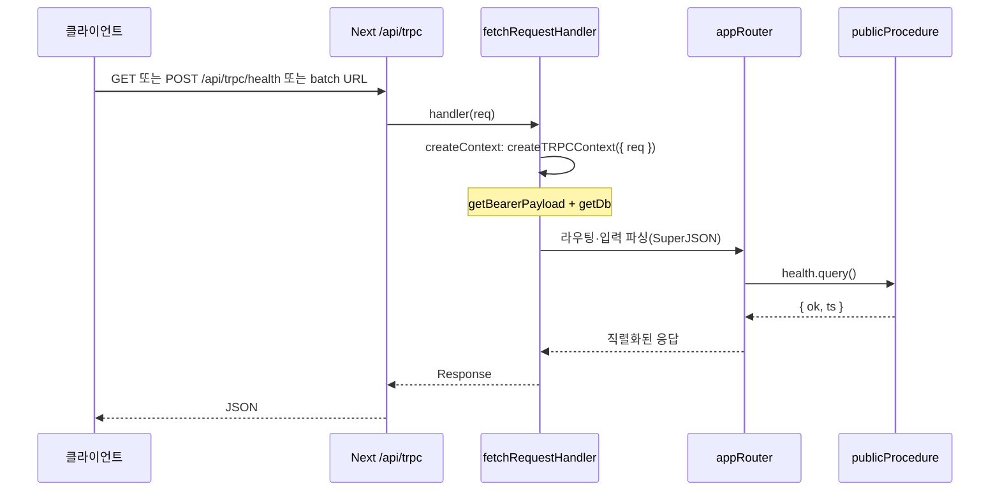

# next-book-app

Next.js 단일 앱으로 **인증·게시글·북(슬라이드) 에디터·AI 보조·채팅·데모 API**까지 묶은 풀스택 프로젝트입니다. UI는 Tailwind 4 및 shadcn 스타일 컴포넌트를 사용합니다.

---

## 기술 스택

| 구분                | 사용 기술                                                                                                                                                                |
| ------------------- | ------------------------------------------------------------------------------------------------------------------------------------------------------------------------ |
| 프레임워크          | **Next.js 16** (App Router), **React 19**                                                                                                                                |
| 커스텀 서버         | **`server.ts`**: HTTP 하나에 Next `getRequestHandler` + **Socket.IO** (`/socket.io`, 네임스페이스 `/chat`)                                                               |
| API                 | **서버 액션** (`src/actions/*.ts`, `"use server"`) + **Route Handlers** (`src/app/api/**/route.ts`, `/api/...`) — 아래 **서버 액션과 API 라우트(Route Handler)** 절 참고 |
| DB                  | **PostgreSQL**, **Drizzle ORM**, 드라이버 `postgres`                                                                                                                     |
| 인증                | **JWT**(액세스·리프레시), **jose**, 액세스는 `sessionStorage`, 리프레시는 **httpOnly 쿠키** + 로테이션                                                                   |
| 실시간              | **socket.io** / **socket.io-client** — 로비·방 채팅, 메시지·방 메타 **DB 영속화**                                                                                        |
| 타입 안전 API(보조) | **tRPC** — 예: `health` 등 최소 프로시저 (`/api/trpc`)                                                                                                                   |
| HTTP 클라이언트     | **axios** (`baseURL` 기본 `/api`, `withCredentials`)                                                                                                                     |
| 상태·데이터         | **Zustand**(인증), **TanStack Query**                                                                                                                                    |
| 검증                | **Zod**                                                                                                                                                                  |
| 스타일              | **Tailwind CSS 4**, **Radix / Base UI**, **CVA**, **next-themes**                                                                                                        |
| 에디터·미디어       | **TipTap**, **Konva**, **react-konva**, **Three.js** + **R3F**·**drei** 등(홈 3D·북 관련)                                                                                |

---

## 주요 프로그램 흐름



1. **요청 진입**: 브라우저는 페이지·RSC는 Next로, **글·북·Cats** 도메인은 **서버 액션**으로, 그 외 **인증·프로필·날씨·뉴스·tRPC** 등은 **`/api/*`** Route Handler로 요청합니다.
2. **정적 업로드**: 파일은 디스크(`UPLOAD_ROOT`)에 두고 **`/uploads/[...path]`** 라우트로 서빙합니다.
3. **채팅**: 로그인 후 **`ChatDock`**이 **동일 오리진**의 `/chat` 네임스페이스에 연결합니다. JWT는 `auth: { token }`으로 핸드셰이크 시 검증합니다.
4. **부트스트랩**: 서버 기동 시(및 일부 인증 진입 시) `ensureUserBootstraps()`로 초기 관리자 등 시드 로직이 실행될 수 있습니다 (`src/instrumentation.ts`, `bootstrap` 서비스).

---

## 인증 흐름

### 토큰 역할

- **액세스 JWT**: 짧은 만료. 클라이언트는 **`sessionStorage`** 키 `access_token`에 보관하고, API 요청 시 **Authorization: Bearer** 로 전송합니다.
- **리프레시 JWT**: 긴 만료. **httpOnly·Secure(프로덕션) 등 쿠키**로만 전달되며, 클라이언트 JS에서 읽지 않습니다. 갱신 시 새 리프레시로 **로테이션**됩니다.

### 클라이언트 세션 복구 (`auth-store` → `hydrate`)

1. `sessionStorage`에 액세스 토큰이 있으면 **`GET /api/users/me`** 로 프로필 조회.
2. 실패(만료 등) 시 **`POST /api/auth/refresh`** (쿠키만)로 새 액세스 토큰 발급 후 다시 `/users/me`.
3. 액세스 토큰이 없어도 리프레시 쿠키가 있으면 refresh 후 동일하게 복구.
4. 끝까지 실패하면 액세스 토큰을 제거하고 비로그인 처리, **`isReady: true`** 로 UI가 스피너 대신 본 화면을 그립니다.

### 주요 API 엔드포인트

| 메서드    | 경로                        | 설명                                                    |
| --------- | --------------------------- | ------------------------------------------------------- |
| POST      | `/api/auth/signup`          | 회원가입                                                |
| POST      | `/api/auth/signin`          | 로그인 — JSON에 `access_token`, `Set-Cookie`에 리프레시 |
| POST      | `/api/auth/refresh`         | 리프레시 쿠키로 액세스 재발급(및 쿠키 갱신)             |
| POST      | `/api/auth/logout`          | 로그아웃·쿠키 정리                                      |
| GET/PATCH | `/api/users/me`             | 내 프로필 조회·수정                                     |
| GET       | `/api/users/admin`          | 관리자용 사용자 목록 등                                 |
| POST      | `/api/users/admin/set-role` | 역할 변경                                               |

JWT 서명·검증·만료 설정은 `src/server/auth/jwt.ts`, 상수는 `src/server/env.ts`를 참고하면 됩니다.

---

## 도메인 기능과 API 개요

- **게시글(글)**: 서버 액션 `src/actions/posts.ts` — 목록·작성·수정·삭제, `category`·검색·커서, 댓글·좋아요, 멀티파트 첨부. UI는 `src/lib/api.ts` 래퍼가 동일 함수명을 유지합니다.
- **북(슬라이드)**: 서버 액션 `src/actions/books.ts` — 목록·상세·CRUD·미디어 업로드·북 AI 채팅/레이아웃 해석.
- **채팅(소켓)**: 네임스페이스 `/chat` — 방 목록·입장·메시지·방 삭제 등. 스키마: `chat_room`, `chat_message` (`src/server/db/schema.ts`).
- **Cats (학습/데모)**: 서버 액션 `src/actions/cats.ts` — 아래 절 참고.
- **날씨·뉴스(데모)**: `/api/weather/current`, `/api/weather/seoul`, `/api/news/headlines` — 외부 API 키·쿼리는 각 Route Handler·서비스 참고.

페이지는 `src/app/(site)/**/page.tsx`가 라우트이고, 실제 화면 본문은 `@/page-components/*`에서 import하는 구조입니다(Next가 `src/pages`를 Pages Router로 오인하지 않도록 분리).

### 서버 액션과 API 라우트(Route Handler)

이 프로젝트는 **서버 액션**과 **`/api/...` API 라우트**를 **동시에** 사용합니다. 둘 다 서버에서 실행되며, 공통으로 `@/server/services/*` 등을 호출할 수 있습니다.

| 구분                           | 설명                                                                                                                                           | 이 저장소에서의 예                                                                |
| ------------------------------ | ---------------------------------------------------------------------------------------------------------------------------------------------- | --------------------------------------------------------------------------------- |
| **서버 액션**                  | 파일 상단 `"use server"`로 표시한 `async function`을 클라이언트에서 import해 호출합니다. HTTP 메서드·URL을 직접 만들지 않습니다.               | `src/actions/posts.ts`, `books.ts`, `cats.ts`, `session-token.ts`                 |
| **API 라우트 (Route Handler)** | `src/app/api/.../route.ts`에서 `GET` / `POST` 등을 export하고 `NextResponse.json` 등으로 응답합니다. **axios** 등으로 `/api/...`에 요청합니다. | `src/app/api/auth/*`, `users/*`, `weather/*`, `news/*`, `trpc/*`, `cats/_study/*` |

**인증**: 서버 액션은 액세스 JWT를 **인자로** 넘기고 `session-token.ts`에서 검증합니다. API 라우트는 **`Authorization: Bearer`** 헤더(`requireBearerPayload(request)` 등)를 사용합니다.

#### 서버 액션 예시 (`"use server"` + 글 목록)

```1:2:src/actions/posts.ts
"use server";

```

```54:81:src/actions/posts.ts
/** 공개 목록(커서 페이지네이션). Bearer 있으면 likedByMe 등 반영 */
export async function listPostsAction(
  accessToken: string | null | undefined,
  params?: {
    cursor?: string;
    take?: number;
    search?: string;
    category?: string;
  },
): Promise<PostsPageResponse> {
  try {
    const takeRaw = Number(params?.take ?? 12);
    const take = Math.min(50, Math.max(1, takeRaw));
    const search = params?.search?.trim();
    const category = params?.category?.trim();
    const cursor = params?.cursor;
    const user = await getUserFromTokenOptional(accessToken);
    const posts = new PostsService();
    return (await posts.findPage(
      take,
      user?.sub,
      search ?? undefined,
      category ?? undefined,
      cursor ?? undefined,
    )) as unknown as PostsPageResponse;
  } catch (e) {
    rethrowActionError(e, "posts-actions");
  }
}
```

#### 클라이언트 쪽 연결 (`src/lib/api.ts`에서 액션 호출)

UI와 기존 헬퍼 이름을 유지하기 위해 **`fetchPostsPage` 등이 내부에서 서버 액션을 호출**합니다.

```3:24:src/lib/api.ts
import {
  createBookAction,
  deleteBookAction,
  fetchBookAiChatAction,
  getBookAction,
  listBooksAction,
  requestBookLayoutAiAction,
  updateBookAction,
  uploadBookMediaAction,
} from "@/actions/books";
import {
  createPostAction,
  createPostCommentAction,
  deletePostAction,
  deletePostCommentAction,
  fetchPostCommentsAction,
  getPostAction,
  likePostAction,
  listPostsAction,
  unlikePostAction,
  updatePostAction,
} from "@/actions/posts";
```

```384:401:src/lib/api.ts
/** 공개 글 목록 커서 페이지네이션 (무한 스크롤·더 보기) */
export async function fetchPostsPage(params?: {
  cursor?: string;
  take?: number;
  /** 제목·본문 부분 일치 */
  search?: string;
  /** tech | life | study | chat | general */
  category?: string;
}): Promise<PostsPageResponse> {
  const search = params?.search?.trim();
  const category = params?.category?.trim();
  return listPostsAction(getAccessToken(), {
    take: params?.take ?? POST_PAGE_DEFAULT,
    ...(params?.cursor ? { cursor: params.cursor } : {}),
    ...(search ? { search } : {}),
    ...(category ? { category } : {}),
  });
}
```

#### API 라우트 예시 (쿼리 스트링 + `NextResponse.json`)

```1:16:src/app/api/weather/current/route.ts
import { NextResponse } from "next/server";

import { handleRouteError } from "@/server/http/api-response";
import { WeatherService } from "@/server/services/weather.service";

export async function GET(request: Request) {
  try {
    const { searchParams } = new URL(request.url);
    const q = searchParams.get("q") ?? undefined;
    const weather = new WeatherService();
    const data = await weather.getWeather(q);
    return NextResponse.json(data);
  } catch (e) {
    return handleRouteError(e);
  }
}
```

#### API 라우트 예시 (Bearer + `requireBearerPayload`)

```30:45:src/app/api/users/me/route.ts
export async function GET(request: Request) {
  try {
    const user = await requireBearerPayload(request);
    const users = new UsersService();
    const me = await users.getMeProfile(user.sub);
    return NextResponse.json({
      sub: me.sub,
      email: me.email,
      name: me.name,
      imageUrl: me.imageUrl,
      role: me.role,
    });
  } catch (e) {
    return handleRouteError(e);
  }
}
```

---

### 게시글 카테고리(글 `category`)

- **허용 값**: `tech` · `life` · `study` · `chat` · `general` (한글 라벨: 기술·일상·학습·잡담·일반).
- **목록**: `listPostsAction`에 `category` 인자로 필터. UI는 `PostListPage`에서 URL `?category=` 와 동기화.
- **정규화**: 서버는 `normalizePostCategory` (`src/server/posts/post-categories.ts`)로 저장·검증합니다.

### Cats (학습용 CRUD + 이미지)

NestJS 스타일 학습 흔적(가드 샘플·메타 필드)이 일부 붙어 있는 **별도 데모 도메인**입니다. 게시글 `category`와 무관합니다.

**서버 액션** (`src/actions/cats.ts`):

| 액션                   | 설명                                                                      |
| ---------------------- | ------------------------------------------------------------------------- |
| `listCatsAction`       | 전체 목록. 응답에 `_study.decoratorCatsClientMeta`(IP·UA 스냅샷) 포함     |
| `getCatAction`         | 단건                                                                      |
| `createCatAction`      | 등록 — **액세스 JWT 인자 필수**, 본문 파싱은 `parseCreateCatBody`와 동일  |
| `updateCatAction`      | 수정 — 소유자 또는 관리자 (`canMutateCatResource`)                        |
| `deleteCatAction`      | 삭제 — 동일 권한                                                          |
| `uploadCatImageAction` | `FormData`의 `image`로 업로드(용량·MIME 제한), `/uploads/...` 경로로 노출 |

- **DB**: 테이블 `study_cats` — `name`, `age`, `breed`, `ownerId`, `imageFilename`, 타임스탬프 (`src/server/db/schema.ts`).
- **UI**: `/cats`, `/cats/[id]` — `CatsPage`, `CatDetailPage`; TanStack Query + 위 서버 액션. 클라이언트는 `sessionStorage`의 JWT를 액션 인자로 넘깁니다.
- **참고**: `/api/cats/_study/guard-sample` — 가드 순서 학습용 샘플 Route Handler(REST).

#### App Router 프리패치 (Cats만 — 공부용)

Next.js App Router에서는 **라우트 세그먼트**를 미리 받아 두어, 사용자가 링크를 누를 때 전환을 빠르게 만들 수 있습니다. 공식 설명은 [Linking and navigating — Prefetching](https://nextjs.org/docs/app/building-your-application/routing/linking-and-navigating#prefetching)을 참고하면 됩니다.

| 수단                        | 역할                                                                 |
| --------------------------- | -------------------------------------------------------------------- |
| **`<Link prefetch={...}>`** | 뷰포트 등에 따라(기본 동작) 또는 명시적으로 RSC 페이로드를 미리 요청 |
| **`router.prefetch(href)`** | 클라이언트 컴포넌트에서 원하는 시점에 동일한 프리패치를 코드로 호출  |

`prefetch` 값 요약(Next 16 기준):

- **`true`**: `loading.js` 유무와 관계없이 **전체 RSC 트리**를 프리패치하려고 시도합니다(동적 세그먼트에서 차이를 두고 실험할 때 유리).
- **`false`**: 프리패치하지 않습니다.
- **기본(`undefined` / `"auto"` 등)**: 정적·동적에 따라 프레임워크가 범위를 조절합니다.

**이 프로젝트 적용 범위**

- **전역 내비**(헤더·푸터): **Cats** 링크만 `prefetch`(= `true`). 홈·글·북 등은 `NavLink`에서 `prefetch`를 넘기지 않아 **Next 기본**을 유지합니다.
- **`CatsPage`**: 목록이 준비되면 상위 N마리(현재 12)에 대해 `router.prefetch('/cats/…')`를 호출하고, 테이블의 상세 `Link`에는 `prefetch`를 붙입니다.
- **`CatDetailPage`**: 마운트 시 `router.prefetch("/cats")` + 목록으로 가는 `Link`에 `prefetch`.

> **참고**: 문서상 **프리패치는 프로덕션에서 더 두드러집니다**. `npm run dev`만으로는 네트워크 탭·로그(`appLog("cats", "공부용 prefetch", …)`) 위주로 확인하고, 동작을 확실히 보려면 `npm run build` 후 `npm run start`를 권장합니다.

**1) `NavLink`에서 `Link`의 `prefetch`를 그대로 노출**

`src/components/NavLink.tsx` — 특정 메뉴만 명시적으로 켜기 위해 선택 prop으로 둡니다.

```tsx
import Link from "next/link";
import type { ComponentProps } from "react";

type LinkPrefetch = ComponentProps<typeof Link>["prefetch"];

export function NavLink({
  href,
  prefetch,
  /* ... */
}: {
  href: string;
  prefetch?: LinkPrefetch;
  /* ... */
}) {
  return (
    <Link href={href} prefetch={prefetch} /* className … */>
      {children}
    </Link>
  );
}
```

**2) 레이아웃 — Cats 탭만 `prefetch`**

`src/components/layout/AppLayout.tsx` (헤더·푸터 동일 패턴):

```tsx
// 헤더·푸터: {/** 공부용: Cats만 full RSC 프리패치 … */} 주석을 두고
<NavLink href="/cats" prefetch className={headerNavClass}>
  Cats
</NavLink>
```

**3) 목록 — 데이터 로드 후 `router.prefetch` + 행 링크**

`src/page-components/CatsPage.tsx` — 상한·이펙트(프로그래밍 방식):

```tsx
const CAT_DETAIL_PREFETCH_CAP = 12;

const router = useRouter();
// … useQuery로 cats 목록을 받은 뒤

useEffect(() => {
  if (cats.length === 0) return;
  const slice = cats.slice(0, CAT_DETAIL_PREFETCH_CAP);
  for (const c of slice) {
    router.prefetch(`/cats/${c.id}`);
  }
  appLog("cats", "공부용 prefetch", { count: slice.length });
}, [cats, router]);
```

같은 파일 — 테이블의 썸네일·이름 링크(선언적 방식):

```tsx
<Link href={`/cats/${c.id}`} prefetch className="…">
  {c.name}
</Link>
```

**4) 상세 — 목록 경로 프리패치 + 뒤로 링크**

`src/page-components/CatDetailPage.tsx`:

```tsx
useEffect(() => {
  if (!Number.isFinite(id)) return;
  router.prefetch("/cats");
  appLog("cats", "공부용 prefetch 목록", { id });
}, [id, router]);
```

```tsx
<Link href="/cats" prefetch>
  ← 목록
</Link>
```

### 날씨·뉴스 API(요약)

| 메서드 | 경로                   | 설명                                                                                       |
| ------ | ---------------------- | ------------------------------------------------------------------------------------------ |
| GET    | `/api/weather/current` | 쿼리 `q` 등으로 현재 날씨 (`WeatherService`)                                               |
| GET    | `/api/weather/seoul`   | 서울 고정 예시                                                                             |
| GET    | `/api/news/headlines`  | `country`, `category`, `pageSize` — NewsAPI 카테고리 화이트리스트는 서비스 내 `CATEGORIES` |

---

## tRPC 설정과 요청 흐름

이 프로젝트는 **비즈니스 대부분을 REST Route Handler**로 두고, tRPC는 **보조 타입 안전 API** 슬롯으로 `/api/trpc`에 연결되어 있습니다. 패키지는 `@trpc/server`·`@trpc/client`·`@trpc/react-query`(v11)가 있으나, **현재 앱 코드에서는 서버 라우트와 `health` 프로시저만 사용**하고 React tRPC 클라이언트는 아직 연결하지 않았습니다.

### 관련 파일

| 역할                           | 경로                                                        |
| ------------------------------ | ----------------------------------------------------------- |
| Next Route Handler (HTTP 진입) | `src/app/api/trpc/[trpc]/route.ts`                          |
| `fetch` 어댑터 + 라우터 연결   | 위 파일에서 `fetchRequestHandler`                           |
| 컨텍스트(DB·JWT)               | `src/server/trpc/context.ts` — `createTRPCContext({ req })` |
| `initTRPC`·SuperJSON           | `src/server/trpc/trpc.ts`                                   |
| 루트 라우터·프로시저 정의      | `src/server/trpc/routers/_app.ts`                           |

### 요청 흐름



### 컨텍스트·프로시저

- **컨텍스트**: `Request`에서 Bearer JWT를 읽어 `user`를 채우고, Drizzle `db`를 넣습니다. REST의 `requireBearerPayload`와 동일한 `getBearerPayload` 계열을 사용합니다.
- **라우터**: `appRouter`에 `health` **query** 하나만 정의되어 `{ ok: true, ts: number }`를 반환합니다.
- **확장**: `src/server/trpc/routers/_app.ts`에 프로시저를 추가하고, 인증이 필요하면 `trpc.ts`에 `protectedProcedure`(미들웨어로 `ctx.user` 검증)를 두는 패턴으로 확장하면 됩니다. 클라이언트에서는 `createTRPCReact<AppRouter>()` + `httpBatchLink`로 `baseUrl + '/api/trpc'`를 지정해 연결할 수 있습니다.

---

## 디렉터리 가이드(요약)

```
src/
  app/                 # App Router — page.tsx, layout, api/, uploads/
  page-components/     # 큰 화면 단위 UI (라우트에서 import)
  components/          # 공용·기능 컴포넌트 (ChatDock, 레이아웃 등)
  server/
    auth/              # JWT, 페이로드 타입
    db/                # Drizzle 스키마·클라이언트
    services/          # 도메인 서비스 (auth, posts, books, …)
    chat/              # Socket.IO `/chat` 네임스페이스 부착 로직
    trpc/              # tRPC context, init, `routers/_app` (엔드포인트 `/api/trpc`)
    cats/              # Cats API 요청 본문 파싱
    books/             # 북 미디어 저장 등 API 전용 헬퍼
    posts/             # 게시글 업로드·정규화 등
    http/              # 쿠키·공통 응답 유틸
  lib/                 # axios 래퍼, 스키마, 쿼리 클라이언트 등
  stores/              # Zustand (auth-store)
server.ts              # Next + Socket.IO 진입점
```

### `src/server` 네이밍·역할

| 경로                                    | 용도                                                                                                                                  |
| --------------------------------------- | ------------------------------------------------------------------------------------------------------------------------------------- |
| **`auth/`**                             | JWT 서명·검증, 페이로드 타입, 리프레시 해시 등 **인증 전용** 유틸                                                                     |
| **`db/`**                               | Drizzle 스키마(`schema.ts`), `getDb()` 등 DB 연결                                                                                     |
| **`services/`**                         | 도메인별 **오케스트레이션** — 파일명은 `*.service.ts`(예: `posts.service.ts`). DTO·공용 타입은 같은 도메인의 `*-types.ts` 등으로 분리 |
| **`http/`**                             | Route Handler 공통 — `api-response`, `request-auth`, `cookies`, `http-error`                                                          |
| **`posts/`**, **`cats/`**, **`books/`** | 해당 API 전용 **파싱·정규화·업로드 헬퍼** (서비스가 두꺼워지면 여기로 뺌)                                                             |
| **`uploads/`**                          | 디스크 저장 등 파일 시스템 유틸                                                                                                       |
| **`trpc/`**                             | context, `trpc` 초기화, `routers/_app`                                                                                                |
| **`chat/`**                             | Socket.IO 네임스페이스 부착·이벤트                                                                                                    |
| **`users/`**                            | 역할 등 **공용 유저 도메인** 타입 (`user-role` 등)                                                                                    |
| 루트 **`env.ts`**                       | 환경 변수·경로 상수(서버에서만 import)                                                                                                |

**클라이언트 경계**: `page-components/`, `app/providers.tsx`, `stores/`에서는 `@/server` **직접 import 금지**(ESLint `no-restricted-imports`). 데이터는 `/api`, Server Action, tRPC 등을 통해서만 다룹니다. `components/` 안에는 RSC와 `"use client"`가 섞여 있어 이 규칙은 해당 폴더 전체가 아니라 위 경로에만 적용합니다.

---

## 환경 변수

로컬은 루트 **`.env`** 를 사용합니다. 주요 항목:

- **DB**: `DB_HOST`, `DB_PORT`, `DB_USERNAME`, `DB_PASSWORD`, `DB_NAME`
- **JWT**: `JWT_ACCESS_SECRET`, `JWT_REFRESH_SECRET`, (선택) `JWT_ACCESS_EXPIRES_IN`, `JWT_REFRESH_EXPIRES_IN`
- **업로드**: `UPLOAD_ROOT`
- **부트스트랩 관리자**: `BOOTSTRAP_ADMIN_EMAILS` (쉼표 구분 이메일)
- **CORS**: `FRONTEND_ORIGIN` (비우면 관대한 기본)
- **프론트 API 베이스**: `NEXT_PUBLIC_API_BASE_URL` — 비우면 **`/api`**(단일 오리진). 별도 API 호스트를 둘 때만 절대 URL 지정

채팅·북 AI·날씨·뉴스 등 외부 API 키는 해당 서비스 코드·기존 `.env` 주석을 참고하면 됩니다.

---

## 스크립트

| 명령                   | 설명                                                                                                      |
| ---------------------- | --------------------------------------------------------------------------------------------------------- |
| `npm run dev`          | `tsx server.ts` — 개발 모드(Next + Socket.IO)                                                             |
| `npm run build`        | 프로덕션 빌드                                                                                             |
| `npm run start`        | 프로덕션 실행(`NODE_ENV=production tsx server.ts`). Windows CMD에서는 환경 변수 설정 방식이 다를 수 있음  |
| `npm run db:push`      | Drizzle 스키마를 DB에 반영(`drizzle-kit push`)                                                            |
| `npm run db:studio`    | Drizzle Studio                                                                                            |
| `npm run db:generate`  | 마이그레이션 SQL 생성                                                                                     |
| `npm run lint`         | ESLint(`eslint-config-next` + import 정렬 + Prettier 충돌 제거)                                           |
| `npm run lint:fix`     | ESLint 자동 수정(import 순서 등). 이후 **`npm run format`** 으로 Prettier를 맞추는 것을 권장합니다        |
| `npm run format`       | [Prettier](https://prettier.io/)로 프로젝트 전역 포맷(`.prettierignore` 제외)                             |
| `npm run format:check` | Prettier 검사만(CI와 동일)                                                                                |
| `npm run typecheck`    | `tsc --noEmit` — 타입만 검사(빌드보다 가볍게 CI에 넣기 좋음)                                              |
| `npm run test`         | [Vitest](https://nextjs.org/docs/app/guides/testing/vitest) 워치 모드(단위·컴포넌트)                      |
| `npm run test:unit`    | Vitest 1회 실행(CI·프리푸시에 적합)                                                                       |
| `npm run test:e2e`     | [Playwright](https://nextjs.org/docs/app/guides/testing/playwright) E2E(`webServer`로 `npm run dev` 기동) |

---

## 코드 품질·CI

- **포맷**: Prettier 설정은 `prettier.config.mjs`, 무시 목록은 `.prettierignore`(`.next`, `node_modules`, `public` 등).
- **Lint**: `eslint.config.mjs` — `eslint-plugin-simple-import-sort`로 import/export 정렬, `eslint-config-prettier`로 스타일 규칙 충돌 제거.
- **GitHub Actions**: `.github/workflows/ci.yml` — `main` / `master`에 대한 push·PR 시 `format:check` → `lint` → `typecheck` → `test:unit` 순 실행(E2E·DB는 포함하지 않음).
- 로컬에서 `lint:fix` 후 import 줄이 바뀌면 Prettier와 어긋날 수 있으므로, **수정 후에는 `npm run format`** 한 번 돌리는 흐름을 권장합니다.

---

## 테스트

설정은 **Next.js 공식 가이드**([Vitest](https://nextjs.org/docs/app/guides/testing/vitest), [Playwright](https://nextjs.org/docs/app/guides/testing/playwright))를 따릅니다. `async` Server Component는 Vitest에서 직접 렌더하기 어렵다는 공식 권고에 맞춰, **유틸·Zod·서버 파싱·클라이언트 UI 일부**는 단위 테스트로, **페이지·API**는 E2E로 나눴습니다.

### 사전 준비

- **단위(`test:unit`)**: PostgreSQL 없이 실행 가능합니다.
- **E2E(`test:e2e`)**: 앱이 뜰 수 있게 **`.env` + DB**가 맞아야 합니다(로컬은 `docker compose -f docker-compose.dev.yml` 등). Playwright 브라우저 최초 1회: `npx playwright install` (또는 CI에서 `npx playwright install --with-deps`).

### 실행 방법

```bash
npm run test          # Vitest — 파일 변경 시 재실행
npm run test:unit     # Vitest — 한 번만
npm run test:e2e      # Playwright — dev 서버 자동 기동 후 e2e/*.spec.ts
```

### 디렉터리

| 경로         | 내용                                                          |
| ------------ | ------------------------------------------------------------- |
| `__tests__/` | Vitest — `*.test.ts` / `*.test.tsx`                           |
| `e2e/`       | Playwright — `*.spec.ts` (`playwright.config.ts`의 `testDir`) |

### 기능별 테스트 매핑

| 기능                     | 단위 테스트(파일·요지)                                                                                           | E2E                                                                                  |
| ------------------------ | ---------------------------------------------------------------------------------------------------------------- | ------------------------------------------------------------------------------------ |
| **인증 UI**              | `forms-schema` — 로그인·회원가입 Zod                                                                             | `navigation.spec.ts` — 로그인 폼, 회원가입 링크                                      |
| **보호 라우트**          | —                                                                                                                | `features-protected.spec.ts` — `/me`, `/posts/new`, `/books/new` → 로그인 리다이렉트 |
| **홈**                   | —                                                                                                                | `features-public.spec.ts` — `/` main 표시                                            |
| **게시글**               | `post-categories`, `forms-schema` — 본문·카테고리                                                                | 글 목록 `/posts`                                                                     |
| **북**                   | `book-presentation-transition`, `book-canvas-label`, `book-presentation-duration`, `sanitizePageBackgroundColor` | 북 목록 `/books`                                                                     |
| **슬라이드쇼(미리보기)** | 전환·체류 시간 계산                                                                                              | (UI E2E는 생략 — 에디터·캔버스 무거움)                                               |
| **Cats**                 | `parse-cat-body`, `auth-policy`, `forms-schema` — catCreate                                                      | `/cats` 페이지                                                                       |
| **tRPC**                 | `trpc-health` — `health` 프로시저                                                                                | `features-api.spec.ts` — `GET /api/trpc/health`                                      |
| **REST API**             | —                                                                                                                | `features-api` — 날씨·뉴스·tRPC 등 (글·북·Cats는 서버 액션)                          |
| **날씨·뉴스**            | —                                                                                                                | `features-api` — `200` 또는 키 미설정 시 `503` 허용                                  |
| **공통 UI**              | `button`, `utils-cn`, `zod-form`, `form-data-utils`                                                              | —                                                                                    |
| **채팅(Socket.IO)**      | —                                                                                                                | 브라우저·세션·실시간 이슈로 **자동 E2E 미포함** — 필요 시 수동·별도 시나리오 권장    |

> **참고**: 북 AI(서버 액션)·채팅(Socket) 등은 외부 키·소켓 의존이 커서 위 표 범위에서 제외했습니다. 추가 시 동일 패턴으로 `__tests__` 또는 `e2e`에 파일을 늘리면 됩니다.

---

## Docker

- **개발**: `docker compose -f docker-compose.dev.yml up` — PostgreSQL + 볼륨 마운트로 `npm run dev`(스키마 `db:push` 포함).
- **배포 예시**: `docker compose up`(루트 `docker-compose.yml`) — 이미지 빌드 후 `npx tsx server.ts`로 기동.

> **배포 참고**: 앱은 **커스텀 `server.ts`** 로 동작하므로, Vercel 같은 순수 서버리스만으로는 Socket.IO까지 동일 구조 유지가 어렵습니다. **Docker·VM·K8s 등 장기 프로세스** 호스팅을 권장합니다.

---

## 확장 시 알아둘 점

- **Socket.IO 수평 확장**: 현재는 단일 프로세스 기준입니다. 인스턴스를 여러 대 띄우려면 **Redis 어댑터** 등으로 방 브로드캐스트를 공유하는 설계가 필요합니다.
- **tRPC**: 구조·흐름·확장 방법은 위 **[tRPC 설정과 요청 흐름](#trpc-설정과-요청-흐름)** 절을 참고하세요.

---

## 라이선스

Private 프로젝트(`package.json`의 `"private": true`).
